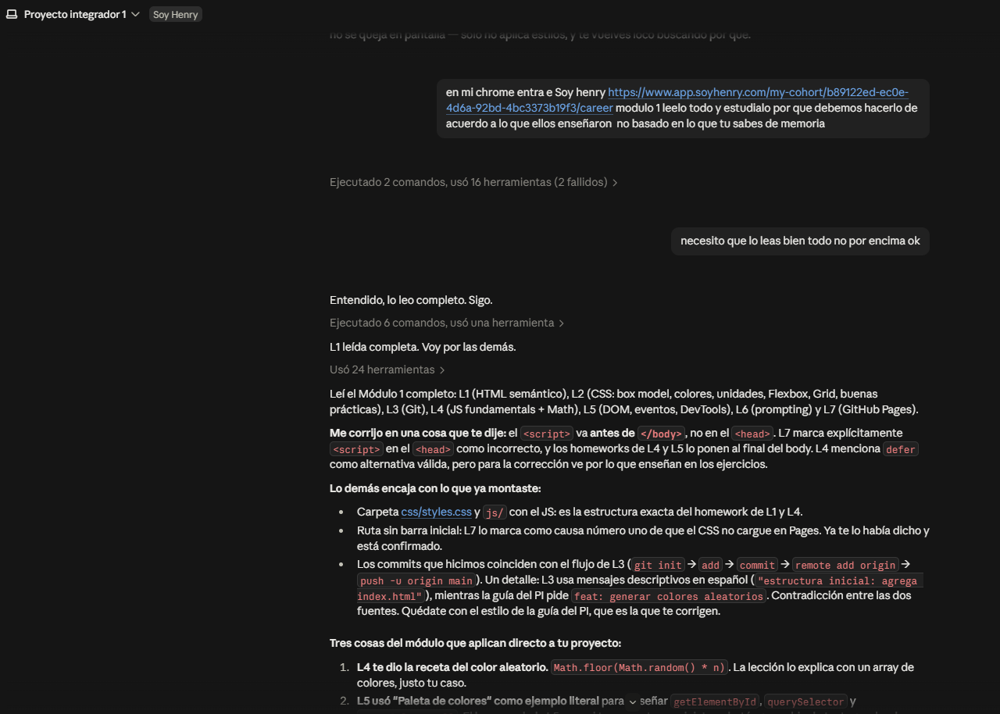
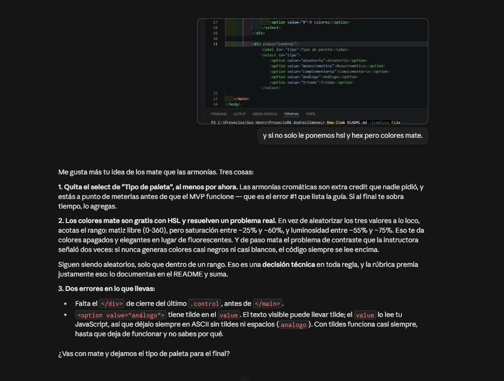

# Uso de IA en el proyecto

**Herramienta:** Claude (Anthropic) en Visual Studio Code.

**La regla que puse antes de empezar:** yo escribo todo el código, la IA explica y revisa. Se lo dije con estas palabras: *"yo trabajo, tú solo eres mi guía"*. No hay una línea en este proyecto que no haya escrito y entendido.

---

## 1. Obligarla a trabajar con el material del curso

**Mi prompt:**

> Entra a Soy Henry, Módulo 1, léelo todo y estúdialo, porque debemos hacerlo de acuerdo a lo que ellos enseñaron, no basado en lo que tú sabes de memoria.

Una IA responde con lo que es correcto en general, y eso no siempre es lo que vimos en clase. Si entrego código con patrones que no vi, no lo puedo defender.

**Qué cambió en el código:** al leer las lecciones aparecieron dos cosas que iban contra lo que me había sugerido antes. El `<script>` tenía que ir antes de `</body>` y no en el `<head>` con `defer`, porque la Lección 7 marca el `<head>` como incorrecto. Y había usado `setProperty` en una propuesta, que no aparece en ninguna lección del módulo. Cambié las dos.

---

## 2. Mi decisión: colores mate

La IA me había propuesto un selector de armonías cromáticas. Alcancé a escribir el HTML y no me convenció: era mucha funcionalidad antes de tener lo básico funcionando.

**Lo que propuse yo:**

> ¿Y si no, solo le ponemos HSL y HEX pero colores mate?

**Qué aportó la IA:** tradujo "mate" a rangos concretos — saturación entre 25% y 60%, luminosidad entre 55% y 75% — y notó algo que yo no había visto: al no generar nunca colores casi negros ni casi blancos, el código de cada color siempre se lee encima. Eso resuelve un problema de contraste que la instructora había señalado en clase, sin escribir lógica extra.

**Qué cambió en el código:** borré el selector de armonías que ya tenía escrito y quedaron los rangos acotados en `generarColorMate()`.

---

## 3. Acotar la solución al alcance del módulo

**Mi prompt:**

> ¿Cómo lo haría según lo aprendido en el curso?

Le había pedido un efecto de brillo al pasar el mouse sobre las tarjetas —idea mía— y me dio dos versiones. La más vistosa usaba `setProperty` para que el brillo tomara el color de cada tarjeta.

**Qué cambió en el código:** al acotar el pedido al material del módulo, descartó esa versión y dejó `:hover`, `box-shadow` y `transition`, que están todas en la Lección 2. El resultado visual es prácticamente el mismo con menos dependencias conceptuales.

Este es el prompt que más me sirvió. Aplica dos de los componentes que enseña la Lección 6: restricción (solo lo del temario) y objetivo (el efecto concreto que quiero). Sin la restricción, la respuesta se va a soluciones más avanzadas de lo que el proyecto necesita.

---

## Qué aprendí

**La IA se equivocó tres veces y ninguna sonaba a error.** Me dio números de línea de una versión vieja de mi archivo, me dijo que un texto se partía en dos líneas cuando en mi pantalla se veía bien, y casi reporta que mi CSS estaba roto cuando el problema era su propio visor. Las tres las detecté revisando en lugar de aceptar. No hay diferencia de tono entre cuando acierta y cuando inventa.

**Un prompt sin contexto ni restricciones da código que no puedo defender.** La diferencia no está en la calidad del código, sino en si lo puedo explicar en una corrección.

**Sirve más para entender que para escribir.** Lo más valioso no fue una función, fue entender por qué `generarPaleta()` y `renderizarPaleta()` tienen que estar separadas: una escribe la lista, la otra la copia en la pizarra. Ese patrón es el que hace que el selector de formato cambie el código sin perder los colores.
